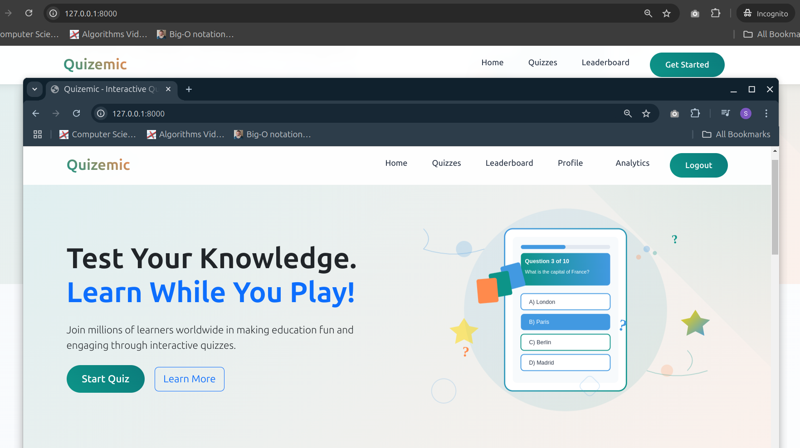

# Quizemic


## Overview
Quizemic is an interactive and engaging quiz platform designed to streamline educational and recruitment processes. It allows users to test their knowledge in various subjects while providing educators and recruiters with a robust platform for evaluating and tracking performance.

## Concepts
1. **Interactivity**: Engaging user experience through quizzes, scoring, and feedback.
2. **Scalability**: Designed to handle increasing user loads and extensible quiz modules.
3. **Security**: User authentication and secure data management.
4. **Customization**: Dynamic quiz creation with multimedia support (SOON).

## Features
- **User Management**: Role-based access control and user authentication.
- **Quiz Management**: Create, read, update, delete (CRUD) quizzes.
- **Analytics**: View user performance and system statistics.
- **Media Support**: Upload and manage media files for quizzes.
- **Responsive Design**: Optimized for desktop and mobile devices.

### Project Demo:- [click here](https://youtu.be/d_pN5j5LSZ8?si=U7H47janGnOAvUYZ)

## Files
| No | File/Directory           | Description                                                                 |
|-------------|--------------------------|-----------------------------------------------------------------------------|
| 1           | `quizemic/`             | Core Django project structure, settings, and URLs.                         |
| 2           | `quiz/`                 | Quiz app handling logic, models, views, and templates.                     |
| 3           | `users/`                | User management app with authentication, profiles, and forms.              |
| 4           | `templates/`           | Frontend templates for quizzes, authentication, and admin functionality.   |
| 5           | `static/`               | Static assets like CSS, JavaScript, and images.                            |
| 6           | `media/`                | Media files for user-uploaded content, such as profile pictures.           |
| 7           | `db.sqlite3`            | SQLite database for development and testing purposes.                      |

## Setup Environment
### Prerequisites
- Python 3.7+
- Virtual environment (`venv` or `quizemic_env2`)
- Git
- Django 4.0+

### Steps to Run Locally
1. **Clone the Repository**:
   ```bash
   git clone https://github.com/rofeeqshittu/quizemic.git
   cd quizemic
   ```

2. **Set Up the Virtual Environment**:
   ```bash
   python3 -m venv quizemic_env2
   source quizemic_env2/bin/activate
   ```

3. **Install Dependencies**:
   ```bash
   pip install -r requirements.txt
   ```

4. **Set Up the Database**:
   ```bash
   python manage.py migrate
   ```

5. **Run the Development Server**:
   ```bash
   python manage.py runserver
   ```
   Access the application at `http://127.0.0.1:8000/`.
    And admin dashboard (page) at `http://127.0.0.1:8000/quiz-admin`

### Optional Steps
- **Create a Superuser** (for admin access):
  ```bash
  python manage.py createsuperuser
  ```
- **Collect Static Files** (for deployment):
  ```bash
  python manage.py collectstatic
  ```

## License
This project is licensed under the MIT License. See the `LICENSE` file for details.

## Contributions
Contributions are welcome! Please fork the repository and submit a pull request with your changes.

---
Enjoy using Quizemic! 🎉


